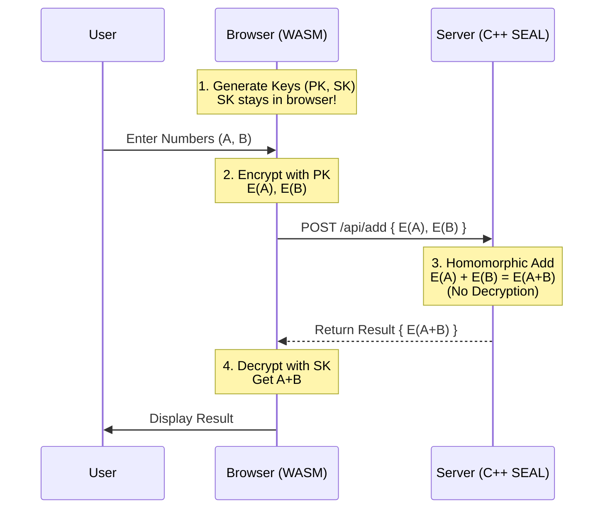

# 🛡️ Homomorphic Encryption Demo: Microsoft SEAL + Docker


> **Privacy-First Computing:** Perform calculations on encrypted data without ever decrypting it.

This project demonstrates a secure **Homomorphic Encryption** system. A web client encrypts data locally, sends it to a server that performs computation (addition) on the encrypted values **without having the decryption key**, and returns the encrypted result to the client for decryption.

---

## 🏗️ System Architecture

The following diagram illustrates the privacy-preserving data flow. **The server never sees the raw data.**



### Key Components

| Component | Technology | Responsibility |
| :--- | :--- | :--- |
| **Frontend** | HTML5, JS, WebAssembly | **Trusted Environment.** Generates keys, encrypts inputs, decrypts results. |
| **WASM Module** | Microsoft SEAL (C++) | Runs cryptographic primitives directly in the browser. |
| **Backend** | C++17, Crow, SEAL | **Untrusted Environment.** Aggregates encrypted data blindly. |
| **Docker** | Docker Compose | Orchestrates the isolated frontend and backend containers. |

---

## 📂 Project Structure

```
sealdockertrial/
├── seal/                          # Microsoft SEAL library (submodule)
├── backend/
│   ├── Dockerfile                 # C++ Server build
│   ├── CMakeLists.txt             # Build configuration
│   └── src/server.cpp             # REST API (Crow + SEAL)
├── frontend/
│   ├── Dockerfile                 # Emscripten -> Nginx build
│   ├── wasm/bindings.cpp           # C++ -> WASM bindings
│   └── public/
│       ├── index.html             # User Interface
│       ├── script.js              # Client-side logic
│       └── favicon.ico            # App Icon
├── docker-compose.yml             # Service orchestration
└── README.md                      # This documentation
```

---

## 🚀 Quick Start

### Prerequisites
*   **Docker** & **Docker Compose**
*   **Git**

### Installation

```bash
# 1. Clone the repository
git clone https://github.com/yourusername/sealdockertrial.git
cd sealdockertrial

# 2. Initialize SEAL submodule
git submodule update --init --recursive

# 3. Build and Run
docker-compose up --build -d
```

### Usage

1.  Open **[http://localhost:3000](http://localhost:3000)** in your browser.
2.  Open the **Developer Console** (F12) to see detailed logs.
3.  Enter two numbers and click **Submit**.
4.  Observe the logs:
    *   `[Client]` Encrypts data.
    *   `[Server]` Receives ciphertext, adds them, returns result.
    *   `[Client]` Decrypts and displays the sum.

---

## 🔒 Security Model

This system implements **Client-Side Encryption** with **Homomorphic Computation**.

### 1. Zero-Knowledge Server
The server possesses only the **Public Key**. It can perform arithmetic on ciphertexts but cannot decrypt them. The **Secret Key** is generated ephemerally in the user's browser and is never transmitted.

### 2. Cryptographic Parameters (CKKS)
We use the **CKKS scheme** for approximate arithmetic on real numbers.

*   **Poly Modulus Degree**: `32768` (High security, ~128-bit)
*   **Coeff Modulus**: `{60, 60, 60, 60, 60, 60, 60}`
*   **Scale**: `2^40`
*   **Compression**: `None` (Required for WASM compatibility)

---

## 🛠️ Technical Details

### Backend (`backend/src/server.cpp`)
*   Uses **Crow** for a lightweight C++ REST API.
*   Implements a global **CORS** handler to allow browser requests.
*   Deserializes Base64 ciphertexts, performs `evaluator.add()`, and reserializes.

### Frontend (`frontend/wasm/bindings.cpp`)
*   Compiles C++ SEAL to WebAssembly using **Emscripten**.
*   Exposes a clean JavaScript API:
    *   `encrypt_number(double)`
    *   `decrypt_number(string)`
    *   `get_context_info()`

---

## 🐛 Troubleshooting

| Issue | Solution |
| :--- | :--- |
| **"Module is not defined"** | Ensure `seal_wasm.js` is loading. Rebuild frontend: `docker-compose up --build frontend` |
| **Server Connection Refused** | Check backend logs: `docker logs sealdockertrial-backend-1`. Ensure port 8080 is free. |
| **"SEALHeader is invalid"** | Compression mismatch. Both client and server must use `compr_mode_type::none`. |

---

**License**: MIT