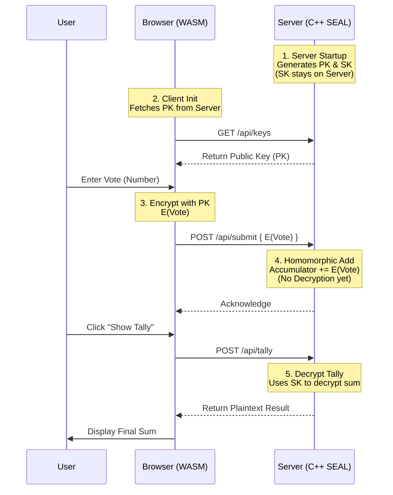

# 🛡️ Homomorphic Encryption Demo: Microsoft SEAL + Docker


> **Privacy-Preserving Voting Demo:** Securely accumulate votes without revealing individual choices.

This project demonstrates a **Homomorphic Encryption** voting system. The server manages the keys and accumulates encrypted votes. It can only decrypt the final aggregated tally, ensuring that individual submissions remain private during the accumulation process.

---

## 🏗️ System Architecture

The following diagram illustrates the actual data flow in this implementation.



### Key Components

| Component | Responsibility |
| :--- | :--- |
| **Server (Backend)** | **Key Authority.** Generates and holds the Secret Key. Accumulates encrypted votes. Decrypts only the final result. |
| **Client (Frontend)** | **Voter.** Fetches Public Key. Encrypts individual votes. Displays the final tally. |
| **WASM Module** | Performs encryption in the browser using the server's Public Key. |

---

## 📂 Project Structure

```
sealdockertrial/
├── seal/                          # Microsoft SEAL library
├── backend/
│   ├── src/server.cpp             # Generates Keys, Accumulates Votes, Decrypts Tally
│   └── Dockerfile                 # C++ Server build
├── frontend/
│   ├── public/script.js           # Fetches PK, Encrypts Inputs
│   ├── wasm/bindings.cpp          # WASM Bindings for SEAL
│   └── Dockerfile                 # Frontend build
├── docker-compose.yml             # Orchestration
└── README.md                      # This documentation
```

---

## 🚀 Quick Start

### Installation & Run

```bash
# 1. Clone and Init
git clone https://github.com/yourusername/sealdockertrial.git
cd sealdockertrial
git submodule update --init --recursive

# 2. Build and Run
docker-compose up --build -d
```

### Usage

1.  Go to **[http://localhost:3000](http://localhost:3000)**.
2.  **Submit Votes**: Enter numbers and click Submit. The browser encrypts them and sends them to the server.
3.  **Show Tally**: Click "Decrypt & Show Tally". The server decrypts the accumulated sum and returns it.

---

## 🔒 Security Model

*   **Server-Side Key Management**: The server generates and holds the Secret Key.
*   **Homomorphic Accumulation**: The server adds encrypted votes together without decrypting them individually.
*   **Privacy**: Individual votes are never decrypted. Only the final aggregated sum is decrypted by the server upon request.

---

## 🛠️ Technical Details

*   **Encryption Scheme**: CKKS (Approximate arithmetic).
*   **Parameters**: Poly Modulus Degree 32768.
*   **API**:
    *   `GET /api/keys`: Returns Public Key.
    *   `POST /api/submit`: Accepts encrypted vote.
    *   `POST /api/tally`: Returns decrypted sum.
*   **WASM Bindings**:
    *   `encrypt_number(double)`: Encrypts value using loaded Public Key.
    *   `get_context_info()`: Returns SEAL context details.
    *   *Note: Decryption is not exposed to the client.*

---

**License**: MIT